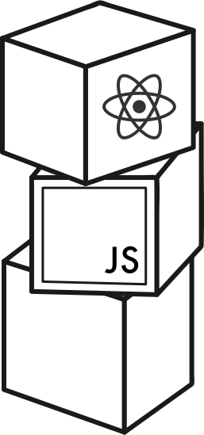

# fullstackcourse 🔥

My submissions for Helsinki University's **Full Stack Open** course.

Course Description: *Deep Dive Into Modern Web Development*

Link: https://fullstackopen.com

---

Main technologies covered:
- React
- Redux
- Node.js
- MongoDB
- GraphQL

---
## About Exercise submissions

This repository covers all parts of the course, except parts 0 and 3. Each exercise has its own README with a demo the final result.

---
## Parts & Progress:
### Part 1
Covers the following topics:

a) Introduction to React

b) Javascript

c) Component state, event handlers

d) A more complex state, debugging React apps

### Exercises
- [x] courseinfo
- [x] unicafe
- [x] anecdotes

---
### Part 2
Covers the following topics:

a) Rendering a collection, modules

b) Forms

c) Getting data from server

d) Altering data in server

e) Adding styles to React app

### Exercises
- [x] Course Content 
- [x] Data For Countries 
- [x] Phonebook
---
### Part 4
Covers the following topics:

a) Structure of backend application, introduction to testing

b) Testing the backend

c) User administration

d) Token authentication

### Exercises
- [x] Blog List 
