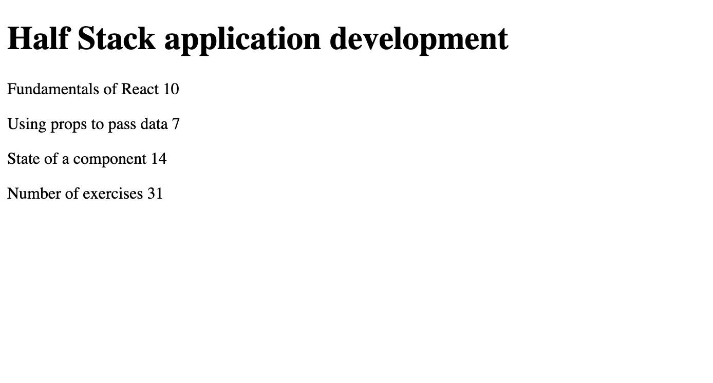

# Part 1 - Course Information 📚

## Task Description
The first sub-task in part 1. The following concepts were involved:
- React components 
- JSX
- Multiple components
- props: passing data to components
  
### Task List
- [x] 1.1
- [x] 1.2
- [x] 1.3
- [x] 1.4
- [x] 1.5
---
## Demo of Finished Exercise

