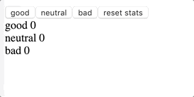

# Part 6 - Unicafe ☕ & Anecdotes 📋 with Redux

## Task List

### Unicafe

- [x] 6.1 - Implement store functionality, the reducer and it's tests
- [x] 6.2 - Implement application functionality

### Anecdotes

- [x] 6.3 - Implement functionality for voting anecdotes. The amount of votes must be saved to a Redux-store
- [x] 6.4 - Implement functionality for adding new anecdotes
- [x] 6.5 - Order anecdotes by number of votes
- [x] 6.6 - Separate creation of action-objects to action creator-functions
- [x] 6.7 - Separate creation of new anecdotes into its own component along with its logic
- [x] 6.8 - Separate rendering of anecdote into its own component along with its logic
- [x] 6.9 - Render notifications from Redux store
- [x] 6.10 - Display a notification when user up votes or adds a new anecdote
- [x] 6.11 - Implement filtering for the anecdotes that are displayed to the user
- [x] 6.12 - Add react-redux package to the application & modify the AnecdoteList to access the store's state with the help of the connect function
- [x] 6.13 - Same for the Filter and AnecdoteForm components
- [x] 6.14 - Make voting for anecdotes work again, refactor the Notification component to use connect, remove the redundant passing of the store's state via props
- [x] 6.15 - AnecdoteList component only receives a single prop based on the store's state
- [x] 6.16 - Fetch the anecdotes from the backend implemented with json-server upon launch
- [x] 6.17 - Store anecdotes in the backend.
- [x] 6.18 - Initialization of redux-store to happens using asynchronous action creators, using redux-thunk-library
- [x] 6.19 - Creation of a new anecdote to happens using asynchronous action creators
- [x] 6.20 - Save votes to backend
- [x] 6.21 - Use asynchronous action creator for setting notifications

---

## Demo of Finished Exercise

