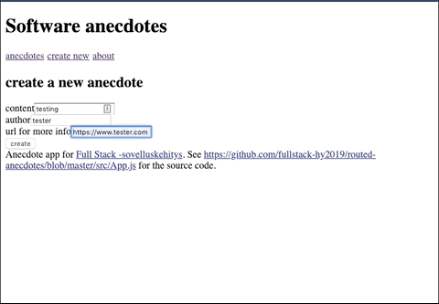

# Part 6 - React Router

## Task List

### Routed Anecdotes

- [x] 7.1 - Add React Router to the application so clicking links in the Menu-component changes view
- [x] 7.2 - Implement a view for showing a single anecdote
- [x] 7.3 - Creating an anecdote takes user to anecdote list & creates notification

---

## Demo of Finished Exercise

